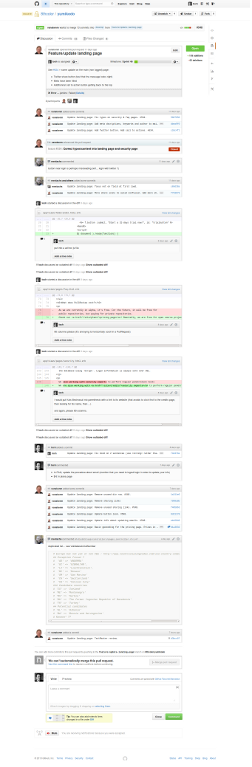
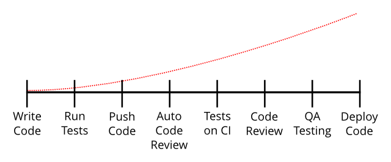

## Safety Nets for Ruby: Tests, Review, and Automation

Christophe Philemotte, Paris.rb 3 Dec 2013

---

### About me

* Developer ([@toch on GitHub](https://github.com/toch), [@_toch on Twitter](https://twitter.com/_toch))
* founder and C?O of 8th Color
* write on [8th Color Blog](http://blog.8thcolor.com)
* [PullReview https://pullreview.com](https://pullreview.com)

---

### Ruby is Dynamic typing

```Ruby
x = false
x = 3
x = 'this is a string'
```
---

### and strong typing

```Ruby
x = '3'
x = x + 3
# TypeError: no implicit conversion of Fixnum into String
```

---

### Ruby is Duck typing


from [Geek and Poke](http://geek-and-poke.com/)

---

```Ruby
class Duck
  def quack
    puts 'Quaaaaaack!'
  end
end

class Person
  def quack
    puts 'The person imitates a duck.'
  end
end

donald = Duck.new
john = Person.new
duck.quack
john.quack

# Quaaaaaack!
# The person imitates a duck.
```
from Wikipedia

---

### Getting Weak Typing with Duck Typing

```Ruby
class Fixnum
  alias_method :old_plus, :+

  def new_plus(other)
    return self.to_s + other if other.kind_of? String
    self.old_plus(other)
  end

  alias_method :+, :new_plus

end

x = '3'
y = 3 + x
```

---

### With Great Freedom

* Meaningfull & Concise
* Flexible & Contract Based
* Easy DI

---

### Comes Great Risk

* Error Only at Runtime
* No Static Interface
* You shouldn't care of the type, but ...

---


---

### How to Mitigate?

* Writing Tests
* Code Review
* Automation

---


---

### Tests Benefits

* Check the Contract and the User Story
* Reliable Changes through Time
* Documentation of the Code
* Guards against Regression and Edge Cases
* Speed the dev Cycle

---

### Tests Framework

* Test:Unit
* MiniTest
* Rspec
* Cucumber

---

### Continuous Integration


---

### Continuous Integration

* Jenkins
* Travis
* CodeShip
* Semapore

---

### Code Review is a Discussion



---

### Code Review is a Discussion


---

### Code Review Benefits

* Knowledge Sharing
* Mutual Education in the Team
* Bug Detection before Shipping
* Readability and Consistency Improvement
* CoOwnership Reinforcement
* Shorter Dev/Test Cycles

---

### Code Review Benefits

> 60% of all issues raised in the code inspections are not problems that could
> have been uncovered by latter phases of testing or field usage because they
> have little or nothing to do with the visible execution behavior of the
> software.
> (H. Siy and L. Votta 2001)

---

### Code Review Tools

* GitHub PullRequest
* Gerrit
* Collaborator
* Crucible

---

### Automated Code Review Benefits

> Automation is necessary. It is common to take a sort of smug satisfaction in
> reports of colossal failures of automatic systems, but for every failure of
> automation, the failures of humans are legion.

---

### Automated Code Review Benefits

> Exhortations to "write better code" plans for more code reviews, pair
> programming, and so on just don’t cut it, especially in an environment with
> dozens of programmers under a lot of time pressure.  The value in catching
> even the small subset of errors that are tractable to static analysis every
> single time is huge.
> John Carmack, 2011

---

### Automated Code Review Benefits

* Short Feedback Time and NOW!
* None Emotional Influences
* Tracking Progress
* Reproducible, Invariable
* Don't Waste Peer Time, Spent time on Complicated.

---


---

### Automated Code Review Tools

* Ruby Warning (Linter)
* Flog (Complexity)
* Flay (Duplication)
* Excellent (a Medley)
* Rails Best Practices (specific to Rails)
* Brakeman (Security)
* Rubocop (Style and Linter)

---

## Ruby WC

*test.rb*

```Ruby
x = 1
```

```Bash
$ ruby -wc test.rb
test.rb:1: warning: assigned but unused variable - x
Syntax OK
```

---

## Flog

```Bash
$ gem install flog
```

*test.rb*

```Ruby
x = 1
if x == 1
  10.times.each { |i| puts i }
end
```

```Bash
$ flog -d test.rb
     6.5: flog total
     6.5: flog/method average

     6.5: main#none
     2.3:   branch
     1.4:   times
     1.3:   puts
     1.2:   each
     1.1:   ==
     1.1:   assignment
     1.0:   lit_fixnum
```

---

## Flay

```Bash
$ gem install flay
```

*test.rb*

```Ruby
def a
  op1
  op2
  op3
end

def b
  op2
  op3
  op4
end
```

```Bash
$ flay -f -m 4 test.rb
Total score (lower is better) = 10

1) Similar code found in :defn (mass = 10)
  test.rb:1
  test.rb:7
```

---

## Excellent

```Bash
$ gem install flay
```

```Ruby
class ShoppingBasket < ActiveRecord::Base

  def initialize(items = [])
    self.items = items
  end

end
```

```Bash
$ excellent test.rb

  Excellent result:

  test.rb
    * Line   1: ShoppingBasket does not specify attr_accessible.
    * Line   1: ShoppingBasket does not validate any attributes.
    * Line   1: ShoppingBasket defines initialize method.

  Found 3 warnings.
```

---

## Rails Best Practices

```Bash
$ gem install rails_best_practices
$ rails new default
$ cd default
$ rails generate scaffold Post name:string title:string content:text
[...]
$ rails_best_practices
Source Codes: |=======================================================================================================================================|
Source Codes: |=======================================================================================================================================|
/tmp/default/app/helpers/posts_helper.rb:1 - remove empty helpers
/tmp/default/app/views/posts/_form.html.erb:1 - replace instance variable with local variable
/tmp/default/app/views/posts/_form.html.erb:2 - replace instance variable with local variable
/tmp/default/app/views/posts/_form.html.erb:4 - replace instance variable with local variable
/tmp/default/app/views/posts/_form.html.erb:7 - replace instance variable with local variable
/tmp/default/app/controllers/posts_controller.rb:50 - simplify render in controllers
/tmp/default/app/controllers/posts_controller.rb:66 - simplify render in controllers

Please go to http://rails-bestpractices.com to see more useful Rails Best Practices.

Found 7 warnings.
```

---

## Brakeman

```Bash
$ gem install brakeman
$ brakeman
[...]
+SECURITY WARNINGS+

+------------+-------+--------+-----------------+----------------------------------------------------------------------+
| Confidence | Class | Method | Warning Type    | Message                                                              |
+------------+-------+--------+-----------------+----------------------------------------------------------------------+
| High       |       |        | Session Setting | Session secret should not be included in version control near line 7 |
+------------+-------+--------+-----------------+----------------------------------------------------------------------+
```

---

## Rubocop

```Bash
$ gem install rubocop
$ rubocop
== ./test/functional/posts_controller_test.rb ==
C:  8: Prefer single-quoted strings when you don't need string interpolation or special symbols.
C: 14: Prefer single-quoted strings when you don't need string interpolation or special symbols.
C: 19: Prefer single-quoted strings when you don't need string interpolation or special symbols.
[...]
== ./db/seeds.rb ==
C:  1: Line is too long. [103/79]
C:  2: Line is too long. [96/79]
== ./script/rails ==
C:  2: Line is too long. [124/79]

26 files inspected, 51 offences detected
```

---

### Automated Code Review Tools

* CodeClimate
* PullReview


---

### Conclusion

* Start right now
* Setup one thing at a time with your team
* It's an incremental and team process
* There are complementary strategies

---

### The more you wait, the more it costs


